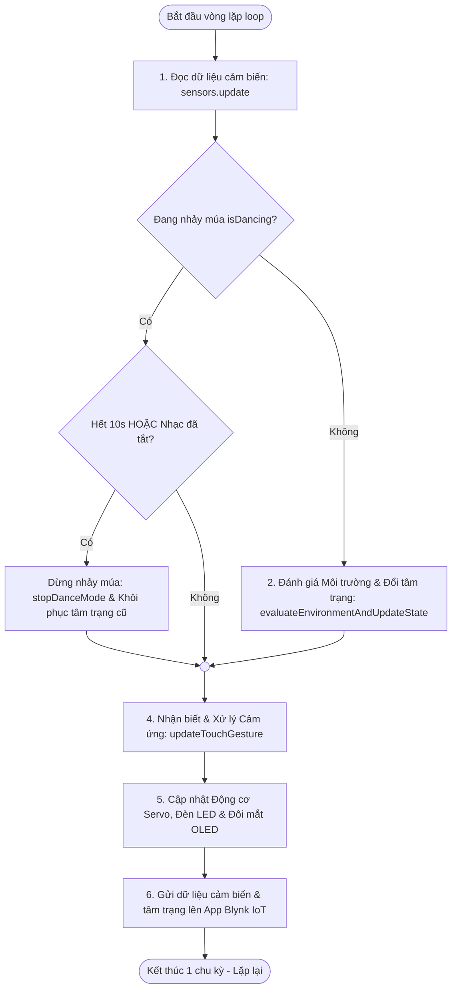
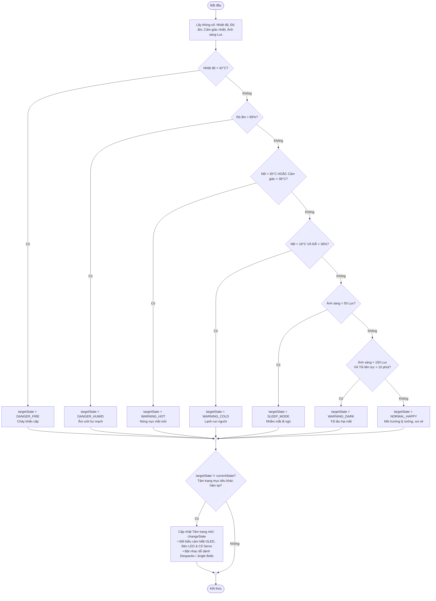
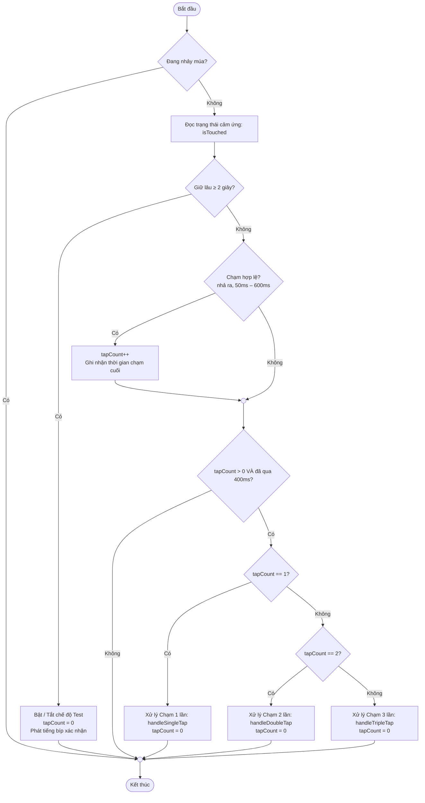
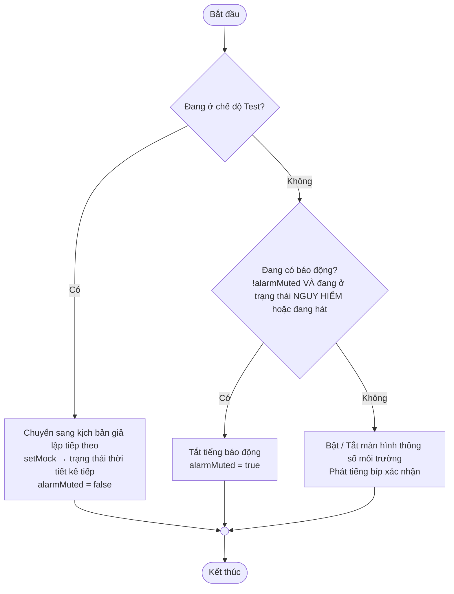
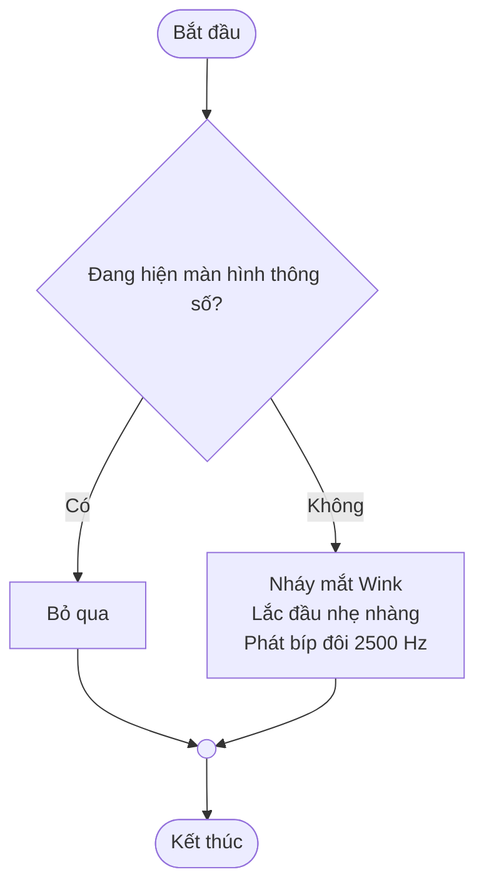
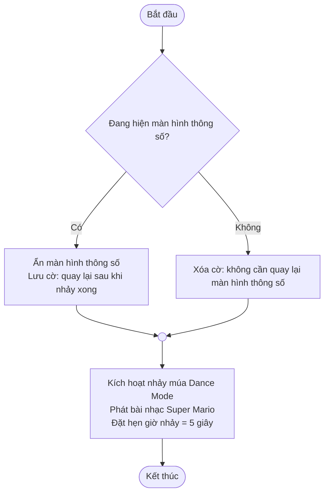

# 🤖 IOT-DeskPet (Robot Thú Cưng Để Bàn Thông Minh)

**IOT-DeskPet** là một dự án robot để bàn tương tác thông minh được phát triển trên vi điều khiển **ESP32**. Robot tích hợp màn hình hiển thị biểu cảm, hệ thống đèn LED hiệu ứng, động cơ servo chuyển động đầu linh hoạt, các cảm biến môi trường và kết nối Cloud qua **Blynk IoT** để giám sát thông số từ xa.

---

## 🌟 Các Tính Năng Nổi Bật

1. **Biểu Cảm Khuôn Mặt Sinh Động (OLED SSD1306 + RoboEyes)**: Mắt robot tự chớp, nhìn xung quanh ngẫu nhiên và biến đổi tâm trạng linh hoạt dựa trên điều kiện môi trường hoặc sự tương tác từ người dùng.
2. **Hệ Thống Phản Hồi Trực Quan (NeoPixel LED & Buzzer)**:
   - Vòng 12 LED WS2812B thay đổi màu sắc và hiệu ứng nhịp thở/chớp nháy tương ứng với từng trạng thái của robot.
   - Còi Buzzer phát âm thanh cảnh báo độc đáo và chơi nhạc các bài hát quen thuộc (*Super Mario*, *Despacito*, *Jingle Bells*).
3. **Cử Động Đầu Tự Nhiên (Servo SG90)**: Robot lắc đầu phản hồi khi được tương tác hoặc xoay đầu tự động để biểu thị tâm trạng.
4. **Giám Sát Môi Trường Từ Xa**: Đo đạc nhiệt độ, độ ẩm (DHT11) và cường độ ánh sáng (BH1750), tự động đồng bộ hóa lên Cloud qua Blynk.
5. **Cấu Hình Chạm Đa Năng (TTP223 Touch Sensor)**: Cho phép chuyển chế độ, tắt âm cảnh báo, bật màn hình thông số, nháy mắt hoặc nhảy múa bằng các thao tác chạm/giữ.
6. **Chế Độ Test Tiện Lợi (Test Mode)**: Giả lập các điều kiện môi trường cực đoan (cháy, nóng, lạnh...) để kiểm tra phản ứng của robot mà không cần dùng lửa hay thiết bị nhiệt độ thật.

---

## 🔌 Sơ Đồ Nối Dây (Pinout Connections)

Dưới đây là cấu hình chân mặc định trên board **ESP32 DevKit V1**:

| Linh Kiện | Chân Trên ESP32 | Mô Tả |
| :--- | :--- | :--- |
| **TTP223 Touch Sensor** | `GPIO 15` | Cảm biến chạm tương tác |
| **DHT11 Sensor** | `GPIO 19` | Cảm biến nhiệt độ & độ ẩm |
| **Servo SG90** | `GPIO 14` | Động cơ quay đầu |
| **NeoPixel LED Ring** | `GPIO 4` | Vòng 12 LED WS2812B |
| **Buzzer** | `GPIO 18` | Còi phát âm thanh / nhạc |
| **OLED Screen & BH1750** | `SDA (GPIO 21)`, `SCL (GPIO 22)` | Giao tiếp I2C hiển thị & cảm biến ánh sáng |

---

## 👆 Hướng Dẫn Sử Dụng Phím Chạm (Touch Gestures Guide)

Cảm biến chạm được tích hợp hệ thống nhận diện cử chỉ thông minh:

### 🔄 Chuyển Chế Độ (Nhấn Giữ 2 Giây)
- **Nhấn giữ cảm biến chạm trong 2 giây**:
  - **Bật Chế Độ Test**: Robot phát **2 tiếng bíp nhanh**, còi/nhạc giả lập sẵn sàng.
  - **Tắt Chế Độ Test**: Trở lại chế độ đọc cảm biến thực tế, robot phát **1 tiếng bíp dài**.

---

### 🟢 Khi Ở Chế Độ Thường (Normal Mode)
- **1 Chạm**: 
  - *Nếu còi báo động hoặc nhạc cảnh báo đang kêu*: **Tắt âm thanh (Muted)** của trạng thái hiện tại.
  - *Nếu không có âm thanh cảnh báo*: **Bật/Tắt màn hình hiển thị thông số môi trường** (Nhiệt độ, Độ ẩm, Ánh sáng dưới dạng thanh tiến trình trực quan).
- **2 Chạm**: Ra lệnh robot nháy mắt (Wink) kết hợp lắc đầu nhẹ.
- **3 Chạm**: Kích hoạt **Dance Mode** trong **5 giây** (Robot nhảy múa xoay đầu, Led chạy hiệu ứng cầu vồng và còi phát nhạc nền *Super Mario*).

---

### 🔴 Khi Ở Chế Độ Test (Test Mode)
- **1 Chạm**: Chuyển đổi tuần hoàn qua các trạng thái giả lập môi trường để test hoạt động của robot:
  1. `NORMAL_HAPPY` (Bình thường - Không giả lập)
  2. `DANGER_FIRE` (Cảnh báo cháy: Led chớp đỏ dồn dập, còi hú siren khẩn cấp)
  3. `DANGER_HUMID` (Cảnh báo ẩm cao: Led đỏ đặc, còi kêu liên tục 1000Hz)
  4. `WARNING_HOT` (Cảnh báo nóng: Led cam, phát nhạc *Despacito* và bíp nhắc)
  5. `WARNING_COLD` (Cảnh báo lạnh: Led cyan, đầu shivering, phát nhạc *Jingle Bells*)
  6. `SLEEP_MODE` (Chế độ ngủ: Mắt nhắm, Led tím mờ)
  7. `WARNING_DARK` (Cảnh báo tối lâu: Led nháy vàng, còi kêu bíp đôi định kỳ)
  - Sau trạng thái 7 sẽ quay lại trạng thái 1.

---

## 📊 Sơ Đồ Thuật Toán & Luồng Xử Lý (System Flowcharts)

File sơ đồ thiết kế chi tiết (Draw.io): [`flowchart.drawio`](flowchart.drawio)

### 1. Sơ đồ Tổng quan Bộ não Robot — Hàm `update()`


---

### 2. Phản ứng Môi trường — Hàm `evaluateEnvironmentAndUpdateState()`


---

### 3. Nhận diện & Xử lý Cảm ứng — Hàm `updateTouchGesture()`


---

### 4. Xử lý Chạm 1 lần — Hàm `handleSingleTap()`


---

### 5. Xử lý Chạm 2 lần & 3 lần — Hàm `handleDoubleTap()` & `handleTripleTap()`

#### 🔹 `handleDoubleTap()` (Chạm 2 lần - Nháy mắt & Lắc đầu)


#### 🔹 `handleTripleTap()` (Chạm 3 lần - Kích hoạt Nhảy múa Dance Mode)


---


## 🛠️ Hướng Dẫn Cài Đặt & Cấu Hình

### 1. Thư viện yêu cầu (Arduino IDE / PlatformIO)
Hãy chắc chắn rằng bạn đã cài đặt đầy đủ các thư viện sau:
- `Adafruit SSD1306` & `Adafruit GFX Library`
- `Adafruit NeoPixel`
- `ESP32Servo` (by Kevin Harrington)
- `BH1750` (by Christopher Laws)
- `DHT sensor library` (by Adafruit)
- `Blynk` (by Volodymyr Shymanskyy)

### 2. Cấu hình WiFi & Blynk
Mở file [blynk_service.h](file:///d:/Materials/4_Semester/IOT102/Project/Project/blynk_service.h) và cập nhật thông tin cá nhân:
```cpp
// Thông tin Blynk Cloud của bạn
#define BLYNK_TEMPLATE_ID "TEMPLATE_ID_CỦA_BẠN"
#define BLYNK_TEMPLATE_NAME "TÊN_TEMPLATE_CỦA_BẠN"
#define BLYNK_AUTH_TOKEN "AUTH_TOKEN_CỦA_BẠN"

// Cấu hình Wi-Fi nhà bạn
#define WIFI_SSID "Tên_Wifi_Của_Bạn"
#define WIFI_PASS "Mật_Khẩu_Wifi_Của_Bạn"
```

Sau đó biên dịch dự án và nạp code xuống board ESP32 của bạn!

---

## 👥 Thành Viên Dự Án (Project Contributors)

| Họ và Tên | Mã Sinh Viên (MSSV) | Vai Trò |
| :--- | :--- | :--- |
| **Nguyễn Huy Nhật** | HE204465 | Thành viên nhóm |
| **Lưu Chí Kiên** | HE204365 | Thành viên nhóm |
| **Phạm Công Hùng** | HE204376 | Thành viên nhóm |

