# Sơ đồ Luồng Chạy Toàn Bộ Chương Trình (Program Flowchart)

Tài liệu này mô tả chi tiết luồng khởi động và vòng lặp hoạt động thời gian thực của Robot IoT DeskPet. Hệ thống hoạt động theo cơ chế hướng đối tượng và lập trình không chặn (non-blocking) bằng cách so sánh mốc thời gian qua hàm `millis()`.

---

## 1. Sơ Đồ Luồng Tổng Quát (Mermaid Flowchart)

```mermaid
flowchart TD
    %% Khai báo Style chung
    classDef startEnd fill:#F5F5F5,stroke:#333,stroke-width:2px;
    classDef setupStyle fill:#E1F5FE,stroke:#0288D1,stroke-width:2px;
    classDef processStyle fill:#E8F5E9,stroke:#388E3C,stroke-width:1.5px;
    classDef decisionStyle fill:#FFFDE7,stroke:#FBC02D,stroke-width:1.5px;
    classDef touchStyle fill:#F3E5F5,stroke:#7B1FA2,stroke-width:1.5px;
    classDef outputStyle fill:#FFE0B2,stroke:#F57C00,stroke-width:1.5px;
    classDef blynkStyle fill:#EDE7F6,stroke:#5E35B1,stroke-width:1.5px;
    classDef warningStyle fill:#FFEBEE,stroke:#D32F2F,stroke-width:1.5px;

    subgraph SETUP ["GIAI ĐOẠN KHỞI TẠO (SETUP PHASE)"]
        Start([Bắt đầu khởi nguồn]):::startEnd
        Setup[Khởi tạo Hệ thống: Setup Phase]:::setupStyle
        InitSerial[1. Khởi động Serial & TOUCH_PIN Input]:::setupStyle
        InitSensors[2. Khởi tạo Sensors: DHT11 & BH1750]:::setupStyle
        InitServo[3. Khởi tạo Servo: Cấp PWM, quay về 90°]:::setupStyle
        InitActuators[4. Khởi tạo Actuators: LED NeoPixel & Còi tắt]:::setupStyle
        InitOLED[5. Khởi tạo OLED: RoboEyes & Vẽ thông số]:::setupStyle
        InitBlynk[6. Khởi tạo Blynk: Kết nối WiFi tối đa 10s]:::setupStyle
        
        Start --> Setup
        Setup --> InitSerial
        InitSerial --> InitSensors
        InitSensors --> InitServo
        InitServo --> InitActuators
        InitActuators --> InitOLED
        InitOLED --> InitBlynk
    end

    subgraph LOOP ["VÒNG LẶP CHÍNH (LOOP PHASE)"]
        LoopStart{Vòng lặp Loop: update}:::decisionStyle
        
        subgraph SENSORS_SERIAL ["1. SERIAL COMMANDS & SENSORS"]
            Step1[handleSerialCommands: Đọc cổng Serial Monitor]:::processStyle
            Step2[sensors.update: Đọc không chặn cảm biến]:::processStyle
            CheckMock{Đang giả lập?}:::decisionStyle
            SetMockValues[Gán giá trị test từ Serial]:::processStyle
            ReadSensors[Cập nhật DHT11 mỗi 2s, BH1750 mỗi 1s]:::processStyle
            
            Step1 --> Step2
            Step2 --> CheckMock
            CheckMock -- "Đúng" --> SetMockValues
            CheckMock -- "Sai" --> ReadSensors
        end

        subgraph STATE_EVALUATION ["2. ĐÁNH GIÁ TRẠNG THÁI"]
            Step3[Kiểm tra Dance Mode]:::processStyle
            CheckDancing{Đang nhảy múa?}:::decisionStyle
            CheckDanceEnd{Đã hết 5s chưa?}:::decisionStyle
            StopDance[Tắt nhảy múa, khôi phục trạng thái cũ]:::warningStyle
            SkipEval[Bỏ qua đánh giá cảm biến môi trường]:::processStyle
            EvalState[evaluateState: Đánh giá cây ưu tiên môi trường]:::processStyle
            CheckStateChange{Trạng thái đổi?}:::decisionStyle
            UpdateState[Cập nhật Trạng thái mới cho Servo, LED, OLED]:::processStyle
            Continue1[Giữ nguyên trạng thái]:::processStyle
            
            Step3 --> CheckDancing
            CheckDancing -- "Đúng" --> CheckDanceEnd
            CheckDanceEnd -- "Rồi" --> StopDance
            CheckDanceEnd -- "Chưa" --> SkipEval
            CheckDancing -- "Sai" --> EvalState
            EvalState --> CheckStateChange
            CheckStateChange -- "Có" --> UpdateState
            CheckStateChange -- "Không" --> Continue1
        end

        subgraph ALARM_TOUCH ["3. ALARMS & TOUCH INTERACTION"]
            Step4[updateBuzzerReminders: Còi nhắc nhở warning]:::processStyle
            Step5[updateTouch: Đọc và phân tích chạm]:::processStyle
            DetectEdge[Nhận diện Sườn Lên/Xuống của Touch]:::processStyle
            CheckGesture{Phân loại cử chỉ?}:::decisionStyle
            HandTap[Chạm đơn: Laugh / Confused]:::touchStyle
            HandDouble["Chạm kép (< 400ms): Nháy mắt trái 1s & Bíp đôi"]:::touchStyle
            HandLong["Chạm giữ (>= 3s): Bật Dance Mode dài 5s"]:::touchStyle
            
            Step4 --> Step5
            Step5 --> DetectEdge
            DetectEdge --> CheckGesture
            CheckGesture -- "Chạm đơn" --> HandTap
            CheckGesture -- "Chạm kép" --> HandDouble
            CheckGesture -- "Chạm giữ" --> HandLong
        end

        subgraph OUTPUTS_BLYNK ["4. CẬP NHẬT ĐẦU RA & CLOUD"]
            Step6[Cập nhật các Cơ cấu Chấp hành]:::processStyle
            UpdateServo[servo.update: Di chuyển Servo mượt]:::outputStyle
            UpdateAct[actuators.update: Cập nhật màu LED & còi bíp]:::outputStyle
            UpdateOLED[emote.update: Vẽ OLED, đảo hướng mắt]:::outputStyle
            
            Step7[blynk.update: Đẩy dữ liệu đám mây]:::processStyle
            CheckBlynkTime{Đủ 5 giây & Có WiFi?}:::decisionStyle
            PushBlynk[Gửi T, H, Lux, Feel, State lên Blynk Cloud]:::blynkStyle
            LoopEnd[Kết thúc chu kỳ update]:::processStyle
            
            Step6 --> UpdateServo
            Step6 --> UpdateAct
            Step6 --> UpdateOLED
            
            UpdateServo --> Step7
            UpdateAct --> Step7
            UpdateOLED --> Step7
            
            Step7 --> CheckBlynkTime
            CheckBlynkTime -- "Đúng" --> PushBlynk
            CheckBlynkTime -- "Không" --> LoopEnd
            PushBlynk --> LoopEnd
        end
    end

    %% Kết nối giữa các khối chính
    InitBlynk --> LoopStart
    LoopStart --> Step1
    
    SetMockValues --> Step3
    ReadSensors --> Step3
    
    StopDance --> Step4
    SkipEval --> Step4
    UpdateState --> Step4
    Continue1 --> Step4
    
    HandTap --> Step6
    HandDouble --> Step6
    HandLong --> Step6
    
    LoopEnd --> LoopStart
```

---

## 2. Chi Tiết Luồng Thực Thi Từng Module

### 2.1. Giai Đoạn Khởi Tạo (Setup Phase)
Chạy duy nhất một lần khi cấp điện cho ESP32 thông qua phương thức `begin()` của [Controller](file:///d:/Materials/4_Semester/IOT102/Project/Project/controller.h):
1.  **Cổng Serial & Chân chạm:** Thiết lập `TOUCH_PIN` (chân 15) là cổng vào kỹ thuật số (`INPUT`).
2.  **Khởi tạo cảm biến ([Sensors](file:///d:/Materials/4_Semester/IOT102/Project/Project/sensors.h)):**
    *   Kích hoạt cảm biến nhiệt độ DHT11 (`dht.begin()`).
    *   Khởi động bus giao tiếp I2C (`Wire.begin()`).
    *   Cấu hình cảm biến ánh sáng BH1750 ở chế độ đo liên tục độ phân giải cao (`CONTINUOUS_HIGH_RES_MODE`).
3.  **Khởi tạo động cơ Servo SG90 ([RobotServo](file:///d:/Materials/4_Semester/IOT102/Project/Project/robot_servo.h)):**
    *   Phân bổ 4 kênh PWM của ESP32 để điều khiển động cơ.
    *   Thiết lập chu kỳ PWM 50Hz, liên kết Servo vào chân `SERVO_PIN` (chân 14) với giới hạn độ rộng xung an toàn từ 500µs đến 2400µs.
    *   Quay đầu robot về vị trí nhìn thẳng mặc định ($90^\circ$).
4.  **Khởi tạo LED & Còi ([Actuators](file:///d:/Materials/4_Semester/IOT102/Project/Project/actuators.h)):**
    *   Khởi động dải LED NeoPixel (`strip.begin()`) và tắt tất cả các bóng LED.
    *   Đặt chân còi `BUZZER_PIN` (chân 18) làm ngõ ra (`OUTPUT`) và gọi `stopTone()` để còi không kêu.
5.  **Khởi tạo Màn hình & Biểu cảm ([Emote](file:///d:/Materials/4_Semester/IOT102/Project/Project/emote.h)):**
    *   Khởi động màn hình OLED qua giao thức I2C địa chỉ `0x3C`.
    *   Thiết lập kích thước vẽ mắt robot là 96x64 pixel (dành riêng 32 pixel bên phải để hiển thị thông số môi trường).
    *   Gắn hàm vẽ dữ liệu cảm biến `drawMetricsOverlay()` làm hàm vẽ đè (Draw Overlay) của màn hình.
    *   Kích hoạt tính năng chớp mắt ngẫu nhiên tự động (`setAutoblinker`).
6.  **Kết nối Blynk & Mạng ([BlynkService](file:///d:/Materials/4_Semester/IOT102/Project/Project/blynk_service.h)):**
    *   Bắt đầu kết nối WiFi không đồng bộ.
    *   Vòng lặp nhỏ kiểm tra kết nối WiFi trong tối đa 10 giây.
    *   Nếu kết nối thành công: Nạp cấu hình Blynk Token và kích hoạt kết nối ngầm tới máy chủ Blynk.
    *   Nếu quá 10 giây không có WiFi: Thông báo thất bại qua Serial và khởi động ngoại tuyến (Offline mode).

---

### 2.2. Vòng Lặp Vận Hành (Loop Phase)
ESP32 lặp lại liên tục hàm `update()` của [Controller](file:///d:/Materials/4_Semester/IOT102/Project/Project/controller.h). Từng tác vụ con được thiết kế dạng máy trạng thái hoặc so sánh mốc thời gian không gây nghẽn:

#### Bước 1: handleSerialCommands (Đọc cổng Serial)
*   Đọc chuỗi ký tự gửi từ máy tính.
*   Nếu nhận lệnh `test 1` $\rightarrow$ `test 9` hoặc `normal`: Bật/Tắt chế độ giả lập dữ liệu cảm biến hoặc tương tác chạm.

#### Bước 2: sensors.update (Đọc cảm biến)
*   **Chế độ Test:** Trả về ngay các thông số giả lập đã gán trước đó.
*   **Chế độ Thường:**
    *   So sánh: Nếu `Thời gian hiện tại - Mốc đọc DHT11 gần nhất >= 2 giây` $\rightarrow$ Đọc nhiệt độ, độ ẩm mới và tính toán chỉ số cảm nhận nhiệt.
    *   So sánh: Nếu `Thời gian hiện tại - Mốc đọc BH1750 gần nhất >= 1 giây` $\rightarrow$ Đọc cường độ ánh sáng (lux) mới.

#### Bước 3: Đánh giá trạng thái nhảy múa & Cây ưu tiên môi trường
*   **Nếu đang nhảy múa (`isDancing == true`):**
    *   Kiểm tra xem thời gian nhảy đã hết 5 giây chưa.
    *   Nếu hết: Tắt trạng thái nhảy, khôi phục lại trạng thái môi trường trước khi nhảy, cập nhật lại cấu hình cho Servo, LED và Biểu cảm.
    *   Nếu chưa: Bỏ qua hoàn toàn việc đánh giá cảm biến môi trường để điệu nhảy không bị ngắt quãng nửa chừng.
*   **Nếu không nhảy múa (`isDancing == false`):**
    *   Đánh giá cây quyết định theo thứ tự ưu tiên từ cao xuống thấp:
        1.  Nhiệt độ $> 42^\circ\text{C} \rightarrow$ `DANGER_FIRE`.
        2.  Độ ẩm $> 85\% \rightarrow$ `DANGER_HUMID`.
        3.  Nhiệt độ $> 30^\circ\text{C}$ hoặc Cảm nhận $> 33^\circ\text{C} \rightarrow$ `WARNING_HOT`.
        4.  Nhiệt độ $< 18^\circ\text{C}$ và Độ ẩm $< 35\% \rightarrow$ `WARNING_COLD`.
        5.  Ánh sáng $< 50\text{ lux} \rightarrow$ `SLEEP_MODE`.
        6.  Ánh sáng $< 150\text{ lux}$ liên tục quá 10 phút $\rightarrow$ `WARNING_DARK`.
        7.  Tất cả chỉ số an toàn $\rightarrow$ `NORMAL_HAPPY`.
    *   Nếu trạng thái vừa đánh giá khác với trạng thái trước đó $\rightarrow$ Kích hoạt chuyển đổi trạng thái (Gửi cấu hình hoạt ảnh mới cho OLED, cài đặt màu LED, góc quay mục tiêu của Servo và thiết lập chu kỳ còi kêu).

#### Bước 4: updateBuzzerReminders (Còi nhắc nhở cảnh báo)
*   Nếu robot đang ở trạng thái `WARNING_HOT`: Mỗi **5 phút** còi sẽ phát một tiếng bíp ngắn.
*   Nếu robot đang ở trạng thái `WARNING_DARK`: Mỗi **1 phút** còi sẽ phát một tiếng bíp đôi.
*   Các trạng thái khác còi sẽ im lặng (trừ khi có báo động khẩn cấp hoặc tương tác chạm).

#### Bước 5: updateTouch (Xử lý cử chỉ chạm đầu)
*   Đọc tín hiệu thực tế từ chân `TOUCH_PIN` (hoặc phím ảo giả lập từ Serial).
*   **Phát hiện sườn lên (Bắt đầu chạm):** Lưu thời gian chạm xuống `touchStartTime`.
*   **Phát hiện sườn xuống (Thả tay):** 
    *   Tính toán thời lượng nhấn giữ. Nếu ngắn hơn 600ms và không phải là nhấn giữ dài $\rightarrow$ tăng bộ đếm số lần chạm (`tapCount`) và lưu mốc thời gian thả tay.
*   **Phát hiện nhấn giữ (Long Press):** Nếu ngón tay vẫn chạm giữ liên tục $\ge 3$ giây $\rightarrow$ Kích hoạt ngay lập tức **Dance Mode** trong 5 giây (Bật cờ `isDancing = true`, lưu lại trạng thái cũ).
*   **Xử lý chạm ngắn (Single/Double Tap):** Chờ 400ms sau lần chạm cuối để phân biệt:
    *   Nếu chạm 1 lần: Gửi hoạt ảnh mắt cười lớn (khi vui vẻ) hoặc mắt bối rối (khi đang gặp cảnh báo).
    *   Nếu chạm 2 lần liên tục: Kích hoạt nháy mắt trái trong 1 giây (`emote.triggerWink()`) và phát còi bíp kép nhí nhảnh.

#### Bước 6: Cập nhật cơ cấu chấp hành (Output Update)
*   **`servo.update()`:** 
    *   Tính toán mượt chuyển động dựa trên góc hiện tại và góc mục tiêu. Di chuyển từng bước nhỏ (`step`) sau mỗi khoảng thời gian (`interval`).
    *   *Chế độ thường:* Di chuyển chậm, đứng yên hoặc tự xoay nhìn ngẫu nhiên sau mỗi 3 phút.
    *   *Cảnh báo lạnh:* Rung lắc Servo nhanh quanh vị trí trung tâm.
    *   *Báo cháy / Nhảy múa:* Servo quét liên tục qua lại rất nhanh từ cực trái sang cực phải.
*   **`actuators.update()`:**
    *   *Đèn LED:* Nhấp nháy màu đỏ báo cháy, sáng đỏ tĩnh khi ẩm, cam khi nóng, xanh lơ khi lạnh, tím mờ khi ngủ, thở xanh lá khi vui vẻ, và nhấp nháy chuyển màu cầu vồng khi nhảy múa.
    *   *Còi:* Hú đổi tần số báo cháy, còi liên tục báo ẩm, phát còi bíp đơn/đôi không chặn từ máy trạng thái, và chơi giai điệu 8 nốt nhạc khi nhảy múa.
*   **`emote.update()`:**
    *   Vẽ lại khung hình OLED. 
    *   Nếu đang nháy mắt (wink): Hiển thị nhắm một mắt trái, mở mắt phải trong 1 giây.
    *   Nếu đang nhảy múa (dance): Tự động xoay hướng liếc mắt liên tục theo vòng tròn (Bắc, Đông Bắc, Đông...).
    *   Cập nhật vẽ RoboEyes hoặc vẽ trực tiếp biểu tượng chết chóc `X_X` (khi cháy). Vẽ bảng thông số nhiệt độ/độ ẩm/ánh sáng ở 32 pixel bên phải màn hình.

#### Bước 7: blynk.update (Đẩy dữ liệu lên Cloud)
*   Gọi `Blynk.run()` để xử lý các gói tin truyền nhận trực tiếp với Blynk Server.
*   So sánh: Nếu `Thời gian hiện tại - Mốc gửi Blynk gần nhất >= 5 giây` và WiFi đang hoạt động tốt:
    *   Gửi các dữ liệu cảm biến và tên trạng thái hiện tại lên Blynk Cloud.
