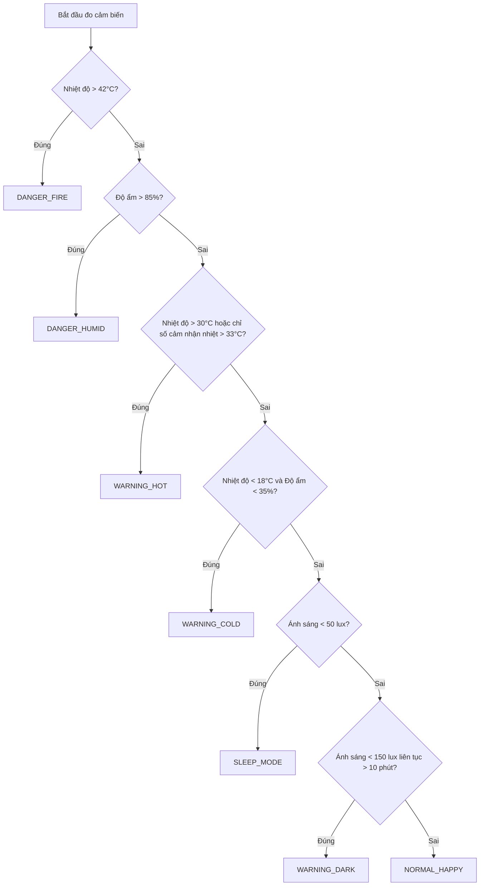

# TÀI LIỆU VẬN HÀNH VÀ LOGIC ĐIỀU KHIỂN ROBOT GIÁM SÁT MÔI TRƯỜNG

Tài liệu này chi tiết cấu hình phần cứng, các trạng thái hoạt động, logic chuyển đổi trạng thái và hành vi cụ thể của từng linh kiện (Màn hình OLED, Đèn LED NeoPixel, Động cơ Servo, Còi Buzzer) của hệ thống Robot IoT tích hợp tính năng phát nhạc.

---

## I. CẤU HÌNH SƠ ĐỒ CHÂN PHẦN CỨNG (PINOUT) & CHÂN ẢO BLYNK

### 1. Sơ đồ chân kết nối ESP32:
Tất cả cấu hình chân linh kiện được khai báo tại phần đầu tệp [controller.h](file:///d:/Materials/4_Semester/IOT102/Project/Project/controller.h):

| Tên Linh Kiện / Tín Hiệu | Định nghĩa chân | Chân Kết Nối (ESP32 Pin) | Ghi Chú |
| :--- | :---: | :---: | :--- |
| **Cảm biến chạm (Touch TTP223)** | `TOUCH_PIN` | **Pin 15** | Digital Input |
| **Cảm biến nhiệt độ, độ ẩm DHT11** | `DHT_PIN` | **Pin 19** | Digital Input |
| **Động cơ Servo SG90** | `SERVO_PIN` | **Pin 14** | PWM Output (Tần số 50Hz) |
| **Đèn LED NeoPixel WS2812B** | `LED_PIN` | **Pin 4** | Digital Output (Data) |
| **Còi thụ động (Passive Buzzer)** | `BUZZER_PIN` | **Pin 18** | PWM / Digital Output |
| **Trục I2C (SDA/SCL)** | Mặc định phần cứng | **SDA / SCL** | Kết nối màn hình OLED và BH1750 |

### 2. Sơ đồ chân ảo ứng dụng Blynk (Virtual Pins):
- **`V0`**: Nhiệt độ đo được (°C) - Gửi lên Cloud.
- **`V1`**: Độ ẩm đo được (%) - Gửi lên Cloud.
- **`V2`**: Cường độ sáng (Lux) - Gửi lên Cloud.
- **`V3`**: Nhiệt độ cảm nhận / Heat Index (°C) - Gửi lên Cloud.
- **`V4`**: Trạng thái hiện tại của Robot (String) - Gửi lên Cloud.
- **`V5`**: Chân điều khiển chọn bài hát (Integer) - Nhận lệnh từ Cloud:
  - `1`: Phát bài **Super Mario** & bắt đầu nhảy múa (`DANCE_MODE`).
  - `2`: Phát bài **Despacito** & bắt đầu nhảy múa (`DANCE_MODE`).
  - `3`: Phát bài **Jingle Bells** & bắt đầu nhảy múa (`DANCE_MODE`).
  - `0`: Tắt nhạc & dừng nhảy múa ngay lập tức.

---

## II. THIẾT KẾ PHẦN MỀM VÀ PHÂN CHIA MODUL (MVC)

Hệ thống được thiết kế theo hướng đối tượng hướng tới sự độc lập của linh kiện (Modular design):
* **`Project.ino`**: Hàm khởi chạy chính (`setup`, `loop`) gọi tuần tự bộ điều khiển trung tâm và định nghĩa hàm callback Blynk `BLYNK_WRITE(V5)` toàn cục.
* **`Controller` (`controller.h`)**: Bộ điều khiển trung tâm (Controller). Quản lý logic đọc cảm biến, logic chuyển đổi trạng thái, tương tác chạm và liên lạc Blynk Cloud.
* **`Sensors` (`sensors.h`)**: Lớp quản lý dữ liệu đầu vào. Đọc không chặn (non-blocking) từ cảm biến DHT11 và BH1750.
* **`Actuators` (`actuators.h`)**: Lớp điều khiển đầu ra cho LED NeoPixel (WS2812B), Còi (Buzzer) và tích hợp trình phát nhạc không chặn tự động (`songs.h`).
* **`RobotServo` (`robot_servo.h`)**: Lớp điều khiển chuyển động của khớp cổ Robot (Servo SG90) giới hạn góc an toàn.
* **`Emote` (`emote.h`)**: Lớp điều khiển giao diện biểu cảm của mắt Robot (RoboEyes) và hiển thị thông số môi trường trên màn hình OLED.
* **`songs.h`**: Định nghĩa tần số âm nhạc và giai điệu/tempo của các bài hát Mario, Despacito, Jingle Bells.

---

## III. CÁC TRẠNG THÁI HOẠT ĐỘNG (STATES) & LOGIC CHUYỂN ĐỔI

Robot liên tục đánh giá thông tin môi trường để chuyển đổi giữa các trạng thái hoạt động dựa trên cây ưu tiên (từ cao xuống thấp):

### Chi tiết logic bộ đếm thời gian ánh sáng yếu (`WARNING_DARK`):
* Khi cường độ sáng rơi vào khoảng nguy cơ ($50\text{ lux} \le \text{Lux} < 150\text{ lux}$), bộ đếm thời gian bắt đầu chạy. Nếu tình trạng này kéo dài liên tục **quá 10 phút (600,000 ms)**, Robot mới chuyển sang trạng thái cảnh báo thiếu sáng `WARNING_DARK`.
* Nếu cường độ sáng phục hồi ($\ge 150\text{ lux}$) hoặc tối hẳn ($< 50\text{ lux}$), bộ đếm thời gian sẽ ngay lập tức được reset để tránh các cảnh báo nhầm không đáng có.

---

## IV. BẢNG CHI TIẾT HÀNH VI CỦA ROBOT TRONG TỪNG TRẠNG THÁI

Khớp đầu Servo của robot được cấu hình ở góc gốc là **90° (nhìn thẳng)**, chỉ có thể xoay trái phải và giới hạn góc tối đa trong khoảng **`[60°, 120°]`** (tức là lệch tối đa $\pm 30^\circ$ so với tâm) để bảo vệ cấu trúc cơ học của robot.

| Trạng thái | Điều kiện kích hoạt | Biểu cảm OLED (Emote) | Đèn LED NeoPixel | Khớp đầu Servo (SG90) | Còi Buzzer (Báo động / Bài hát) |
| :--- | :--- | :--- | :--- | :--- | :--- |
| **`DANGER_FIRE`**  *(Nguy cơ hỏa hoạn)* | $T > 42^\circ\text{C}$ | Hiển thị biểu tượng hoảng loạn `X _ X` (Vẽ trực tiếp bằng đường thẳng). | Chớp tắt màu ĐỎ liên tục với tần số cao (mỗi 100ms). | Quay nhanh qua lại liên tục giữa 2 cực hạn `60°` và `120°` (`step = 6.0`, `interval = 10ms`). | Còi hú báo động liên tục, thay đổi tần số (2500Hz và 1800Hz) mỗi 120ms. **Ngắt toàn bộ nhạc nền**. |
| **`DANGER_HUMID`**  *(Độ ẩm nguy hại)* | $H > 85\%$ | Mắt rủ mệt mỏi (`TIRED`), đổ mồ hôi (`Sweat` hoạt động). | Màu ĐỎ sáng tĩnh ở độ sáng tối đa 100%. | Quay hẳn sang góc cực hạn `60°` (tránh hướng có hơi ẩm của máy phun sương) và đứng yên. | Kêu còi cảnh báo kéo dài liên tục ở tần số cố định 1000Hz. **Ngắt toàn bộ nhạc nền**. |
| **`WARNING_HOT`**  *(Môi trường nóng)* | $T > 30^\circ\text{C}$ hoặc $T_{\text{feel}} > 33^\circ\text{C}$ | Mắt mệt mỏi (`TIRED`). | Màu CAM sáng tĩnh ở độ sáng trung bình 70%. | Xoay chậm chạp qua lại giữa `60°` và `120°` (`step = 1.0`, `interval = 50ms`). | **Tự động phát bài hát Despacito 1 lần**. Sau đó, nếu tiếp tục nóng sẽ kêu 1 tiếng bíp ngắn (1200Hz, 150ms) sau mỗi 5 phút. |
| **`WARNING_COLD`**  *(Môi trường lạnh khô)*| $T < 18^\circ\text{C}$ và $H < 35\%$ | Mắt mệt mỏi, chế độ rung mắt run rẩy (`HFlicker`). | Màu XANH LƠ sáng tĩnh (70% độ sáng). | Rung lắc nhẹ giả vờ run rẩy (dao động nhanh giữa `85°` và `95°`, `step = 10.0`, `interval = 30ms`). | **Tự động phát bài hát Jingle Bells 1 lần**. |
| **`WARNING_DARK`**  *(Cảnh báo thiếu sáng)*| $50 \le \text{Lux} < 150$ kéo dài quá 10 phút. | Mắt nheo lại giận dữ (`ANGRY`) và hướng nhìn lên phía trên. | Chớp tắt màu VÀNG chậm (mỗi 500ms). | Quay về vị trí chính giữa `90°`. | Tắt nhạc tự động. Chỉ phát tiếng bíp đôi (1500Hz, độ dài 80ms, khoảng cách 80ms) sau mỗi 1 phút. |
| **`SLEEP_MODE`**  *(Chế độ ngủ đêm)* | $\text{Lux} < 50$ | Mắt nhắm hẳn lại ngủ ngon. | Màu TÍM mờ (10% độ sáng) đóng vai trò làm đèn ngủ ban đêm. | Quay về chính giữa `90°` và đứng yên hoàn toàn. | Tắt nhạc. |
| **`NORMAL_HAPPY`**  *(Bình thường vui vẻ)*| Tất cả các chỉ số đều ở ngưỡng an toàn. | Mắt cười (`HAPPY`), thỉnh thoảng chớp mắt tự động. | Hiệu ứng "nhịp thở" (breathing) màu XANH LÁ CÂY (chu kỳ 3000ms). | Thỉnh thoảng nhìn ngó xung quanh: ngẫu nhiên quay về góc `{60, 75, 90, 105, 120}` mỗi 3 phút. | Tắt nhạc nền. |
| **`DANCE_MODE`**  *(Chế độ nhảy múa)* | Kích hoạt bởi người dùng qua cảm biến hoặc Blynk. | Mắt cười (`HAPPY`) xoay tròn theo vòng tròn sinh động. | Hiệu ứng LED cầu vồng chạy liên tục nhảy múa. | Quay nhanh liên tục giữa 2 cực hạn `60°` và `120°` (`step = 5.0`, `interval = 12ms`). | **Phát bài hát được chỉ định** (Mario/Despacito/Jingle Bells). Tự động tắt nhảy múa khi bài hát kết thúc. |

---

## V. TƯƠNG TÁC NGƯỜI DÙNG QUA CẢM BIẾN CHẠM (`TOUCH_PIN`)

Robot hỗ trợ giao tiếp tương tác qua cảm biến chạm điện dung TTP223 (sử dụng cơ chế chống rung phím - debounce 1 giây):
* **Chạm đơn (Single Tap)**: Khi ở trạng thái vui vẻ, phát tiếng bíp kép vui vẻ (2000Hz, 80ms) và kích hoạt hiệu ứng hoạt ảnh mắt cười lớn (`anim_laugh`). Ở trạng thái cảnh báo, phát hoạt ảnh mắt bối rối (`anim_confused`).
* **Chạm kép (Double Tap)**: Phát tiếng bíp đôi cheearful vui vẻ và nháy mắt (Wink).
* **Chạm giữ 3 giây (Long Press)**: Đưa robot vào chế độ nhảy múa `DANCE_MODE` và phát bài hát **Super Mario**.

---

## VI. NGUYÊN LÝ LẬP TRÌNH KHÔNG CHẶN (NON-BLOCKING TIMING)

Để đảm bảo khả năng phản hồi thời gian thực, toàn bộ chương trình **không sử dụng bất kỳ hàm hoãn thời gian `delay()` nào**.
Thay vào đó, cơ chế hoạt động song song dựa trên việc so sánh mốc thời gian qua hàm `millis()`:
* **LED Breathing**: Sử dụng hàm lượng giác `sin(millis())` để tính toán cường độ sáng mượt mà theo chu kỳ thời gian thực mà không chặn CPU.
* **Servo Sweeping & Shivering**: Sử dụng các mốc thời gian riêng biệt (`interval` từ 10ms đến 50ms) để di chuyển động cơ từng bước nhỏ, tạo hiệu ứng chuyển động mượt mà trong khi CPU vẫn xử lý được cảm biến và âm thanh.
* **Trình phát giai điệu không chặn (Melody Player)**: Đọc nốt nhạc tuần tự từ mảng dữ liệu. Dựa trên Tempo và loại nốt nhạc để tính độ dài nốt bằng công thức $Duration = \frac{240000}{Tempo \times Type}$. Phát nốt trong 90% thời gian của nó và tắt còi ở 10% còn lại để tạo hiệu ứng staccato sắc nét, tất cả được điều khiển độc lập bởi `millis()`.
